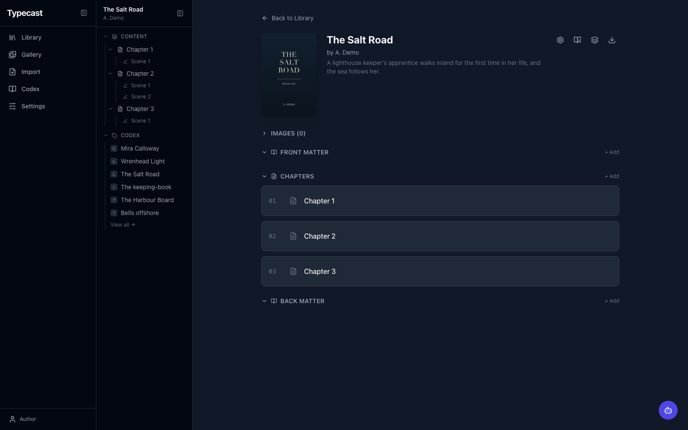
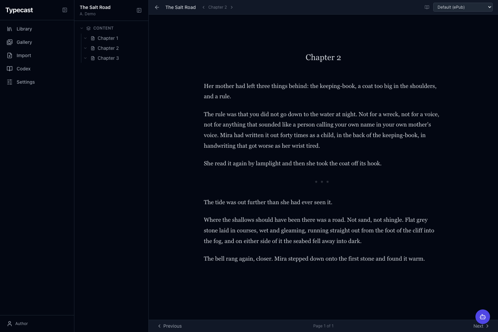
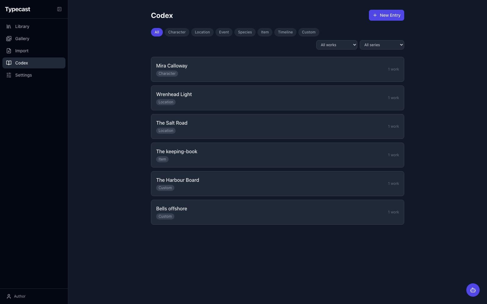

# Typecast

A novel-writing web application with AI-assisted editing, structured content management, and professional export capabilities. Built with FastAPI and React.

Typecast runs entirely on your own machine. Your manuscripts stay in a local SQLite database, and the only data that leaves is what you explicitly send to an AI provider or to Google Drive.



## Screenshots

Reading mode paginates the manuscript with CSS columns, in either an ePub viewport mode or fixed PDF page dimensions that mirror the export exactly.



The codex holds characters, locations, items, and lore. Entries feed the AI assistant as context and can be referenced from chat with `@`.



## Features

### Writing & Editing

- Multi-scene chapter editor with TipTap (ProseMirror-based rich text)
- Fullscreen writing mode with distraction-free interface
- Front/back matter sections (dedication, copyright, foreword, etc.)
- Scene management with insert, split, and reorder
- Inline spellcheck via Hunspell dictionary with codex-aware custom words
- Inline comments anchored to text spans with AI-powered review

### AI Assistant

- Streaming chat panel with tool use (create content, review, generate images, write scenes)
- Three personas: Author (creative, style-matching), Reviewer (constructive feedback), Advisor (informational)
- @mentions to reference codex entries, works, chapters, and scenes as context
- Multimodal input (attach images to chat) and image generation (Bedrock, OpenAI)
- Style matching that analyzes and emulates the author's writing patterns
- AI diff highlighting shows changed text after AI edits

### Knowledge Base (Codex)

- Per-work entries for characters, locations, items, lore, timelines
- Image galleries per entry with primary image selection
- Codex entries provide context to the AI assistant via @mentions
- Per-character voice assignment for narration

### Export & Reading

- PDF export via WeasyPrint with full typographic control (margins, headers, footers, fonts, chapter headings, roman numeral front matter, chapters-start-recto)
- ePub export with cover, inline images, and TOC
- DOCX export with profile-based styling
- Markdown, HTML, and plain text export
- Built-in and custom export profiles with per-work defaults
- Reading mode with CSS column pagination (ePub viewport mode, PDF fixed-dimension mode, spread view)
- Send exports straight to Google Drive, converting Word, HTML, text, and Markdown into native Google Docs for beta readers
- Choose the Drive subfolder and file name per export; missing folders are created for you

### Cover Production

- Print-ready full cover generation (front + spine + back) for B&N Press specifications
- Configurable trim size, spine factor, bleed, and ISBN safe zone
- 300 DPI PNG output with guide lines

### Narration

- Text-to-speech via Amazon Polly with per-character voice mapping
- AI-powered dialogue segmentation for multi-voice narration
- 19 English voices across long-form, neural, and generative engines

### Library & Organization

- Series and standalone works with cover images
- Work-level image gallery with inline insertion into scenes
- Global gallery across every work, with search, filtering by source, and reassignment between works
- Custom font upload (TTF, OTF, WOFF, WOFF2) for profiles and title pages
- Structured title page configuration with per-element font control
- Smart chapter ordering (auto-inserts front/back matter at correct positions)
- Four themes (Default, Solarized, Nord, High Contrast), each with light and dark variants and a custom accent colour

### Infrastructure

- JWT-based auth with transparent local-mode auto-login (single user) and multi-user support
- Backup and restore as a ZIP of the database and all uploads, locally or to Google Drive with optional retention
- Structured request logging with configurable levels and request IDs
- Custom error pages (404 and error boundary)
- User ownership model on works, series, and conversations

## Quick Start

### Without Docker

Requires Python 3.11 or newer and Node 18 or newer.

PDF export uses WeasyPrint, which links against Pango, Cairo, and gdk-pixbuf. Install those first or PDF export will fail at request time with an import error, while every other format keeps working:

```bash
# macOS
brew install pango cairo gdk-pixbuf libffi

# Debian/Ubuntu
sudo apt install libpango-1.0-0 libpangoft2-1.0-0 libcairo2 libgdk-pixbuf-2.0-0
```

**Backend:**

```bash
cd backend
python -m venv .venv
source .venv/bin/activate
pip install -e ".[dev]"   # omit [dev] to skip pytest and ruff
uvicorn app.main:app --reload --host 0.0.0.0 --port 8000
```

**Frontend:**

```bash
cd frontend
npm install
npm run dev -- --port 3000
```

The app will be available at `http://localhost:3000`. The Vite dev server proxies `/api` and `/uploads` to the backend on port 8000.

### With Docker

```bash
cp .env.example .env
# Edit .env with your API keys
docker compose up --build
```

The database and every upload live in the `typecast-data` volume, mounted at `/app/data`. They survive `docker compose down` and rebuilds; `docker compose down -v` deletes the volume and with it your work. Setting `DATABASE_URL` in `.env` moves the database out of that volume, so leave it commented out unless you are pointing at PostgreSQL.

## Configuration

Configuration is managed through environment variables and the in-app Settings page.

| Variable | Default | Description |
| -------- | ------- | ----------- |
| `TYPECAST_DATA_DIR` | `backend/` | Where the database and `uploads/` live. Point this at a volume to keep your work outside the source tree. The Docker image sets it to `/app/data` |
| `DATABASE_URL` | `<data dir>/typecast.db` | Database connection string. Set explicitly, this overrides `TYPECAST_DATA_DIR` for the database only, which will separate it from the uploads |
| `TYPECAST_AUTH_MODE` | `local` | Auth mode: `local` (auto-login) or `multi` (full auth) |
| `TYPECAST_LOG_LEVEL` | `INFO` | Logging level (DEBUG, INFO, WARNING, ERROR) |
| `TYPECAST_LOG_FORMAT` | `text` | Log format: `text` or `json` |
| `TYPECAST_LOG_FILE` | _(none)_ | Optional log file path |
| `TYPECAST_STATIC_DIR` | _(none)_ | Directory of a built frontend to serve from `/`. Used by the Docker image; unnecessary in development, where Vite serves the UI |
| `SECRET_KEY` | `change-me-in-production` | Key for token signing and encryption |

AI provider configuration (Anthropic, OpenAI, or Bedrock) is managed through the Settings page. API keys are encrypted at rest.

### Google Drive

Sending exports to Drive uses your own Google Cloud OAuth client, so nothing is routed through a third-party service. Set it up once:

1. In the [Google Cloud console](https://console.cloud.google.com/apis/credentials), create a project and enable the Google Drive API.
2. Create an OAuth client of type **Web application**.
3. Add `http://localhost:8000/api/gdrive/callback` as an authorised redirect URI. Running with `--ssl` changes the scheme, so register the `https://` form too if you use both modes. Settings shows the exact URI for your current mode.
4. Paste the client ID and secret into Settings → Google Drive, save, then click Connect.

Typecast requests only the `drive.file` scope, which limits it to files it creates — it cannot read anything else in your Drive. Publish the OAuth app in the console rather than leaving it in **Testing**, or Google expires the authorisation every 7 days.

Each export can name a destination. The folder box takes a path relative to your `Typecast` folder, using `/` to nest, and any missing level is created on send. Leave it blank for the top level. The file name box defaults to the work title, and the extension is added from the export format so the two cannot disagree. Because the `drive.file` scope hides folders Typecast did not create, the destination has to be typed rather than picked from your existing Drive.

Once connected, Settings → Backup & Restore can also push backup archives to a `Backups` subfolder and restore from them. Retention is off by default; turning it on deletes older archives from Drive after each successful upload. Restoring replaces the local database and every upload, so anything written since that archive was taken is lost.

## Tech Stack

**Backend:** Python 3.12, FastAPI, SQLAlchemy 2.x (async), SQLite via aiosqlite, Pydantic v2, WeasyPrint, Pillow, ebooklib, python-docx, boto3

**Frontend:** React 18, TypeScript, Vite, TanStack Query, TipTap editor, Tailwind CSS, Lucide icons, Axios

## Project Structure

```text
backend/
  app/
    api/          # FastAPI routers (auth, works, chapters, scenes, codex, etc.)
    db/           # Engine, session, base model, migrations
    models/       # SQLAlchemy ORM models
    schemas/      # Pydantic request/response schemas
    services/     # AI providers, image gen, narration, export, crypto, auth
    repositories/ # Generic SQLAlchemy repository pattern
    paths.py      # Database and uploads locations (honours TYPECAST_DATA_DIR)
  uploads/        # Static files (covers, images, codex, fonts)
frontend/
  src/
    api/          # API client functions (REST + SSE streaming)
    components/   # Shared components (Sidebar, WorkNav, Editor, AIChatPanel, etc.)
    extensions/   # TipTap extensions (spellcheck, comments, ai-diff)
    pages/        # Route-level page components
    types/        # TypeScript interfaces
```

## Development

```bash
# Type check frontend
cd frontend && npx tsc --noEmit

# Lint frontend
cd frontend && npm run lint

# Lint backend
cd backend && .venv/bin/python -m ruff check app/

# Run backend tests (143 tests)
cd backend && .venv/bin/python -m pytest
```

Invoke the backend tools as `.venv/bin/python -m <tool>` rather than `.venv/bin/pytest`. The console scripts carry an absolute shebang from wherever the virtualenv was first created, so they break if the project directory is ever moved.

There is currently no frontend test suite. UI changes are verified with `tsc --noEmit` and in the browser.

## License

Copyright (C) 2026 Brendan Saunders

Typecast is free software: you can redistribute it and/or modify it under the terms of the GNU General Public License as published by the Free Software Foundation, either version 3 of the License, or (at your option) any later version.

This program is distributed in the hope that it will be useful, but WITHOUT ANY WARRANTY; without even the implied warranty of MERCHANTABILITY or FITNESS FOR A PARTICULAR PURPOSE. See the [GNU General Public License](LICENSE) for more details.

Your manuscripts are your own. The GPL covers this software, not anything you write with it.

### Third-party licences

Version 3 rather than 2 is deliberate: four dependencies are Apache-2.0, which GPLv2 cannot incorporate.

ePub export uses [EbookLib](https://github.com/aerkalov/ebooklib), which is AGPL-3.0-or-later. Section 13 of the GPL permits the combination, and running Typecast on your own machine triggers no additional obligation. If you host it as a service other people use, the AGPL's requirement to offer source to those users applies to that component.
